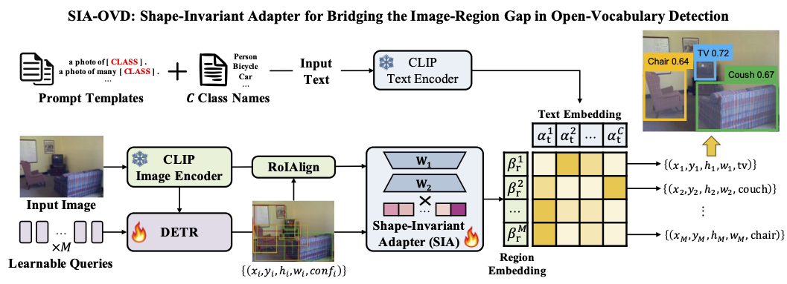
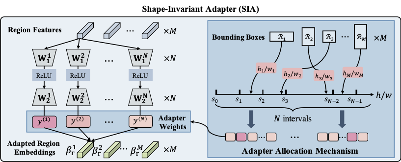

# SIA-OVD: Shape-Invariant Adapter for Bridging the Image-Region Gap in Open-Vocabulary Detection

This is the official PyTorch implementation of SIA-OVD (ACM MM 2024).

[paper](https://openreview.net/forum?id=TqRqTw3itr)

> **SIA-OVD: Shape-Invariant Adapter for Bridging the Image-Region Gap in Open-Vocabulary Detection (ACM MM 2024)**
>
> Zishuo Wang, Wenhao Zhou, Jinglin Xu, Yuxin Peng





## Environment

```bash
# create environment
conda create -n sia-ovd python=3.9.12
conda activate sia-ovd

# install pytorch
pip install torch==1.12.0+cu116 torchvision==0.13.0+cu116 torchaudio==0.12.0 --extra-index-url https://download.pytorch.org/whl/cu116

# manually install pycocotools
pip install cython
git clone https://github.com/cocodataset/cocoapi
cd cocoapi/PythonAPI
make
pip install pycocotools

# install other depensencies
pip install -r requirements.txt

# install detectron2
git clone https://github.com/facebookresearch/detectron2.git
python -m pip install -e detectron2

# compile ops
cd ./models/ops
sh ./make.sh
```

## Dataset

### COCO

Please refer to [CORA]([CORA/docs/dataset.md at master · tgxs002/CORA (github.com)](https://github.com/tgxs002/CORA/blob/master/docs/dataset.md)) for preparing COCO dataset.

### LVIS (optinal)

Download the annotation files ``lvis_v1_train.json``, ``lvis_v1_train_norare.json`` and ``lvis_v1_val.json`` from [Google Drive](https://drive.google.com/drive/folders/17RMc0qoQo68HFvOYbQFX0Hd8OxgDprxT?usp=share_link) and put them under ``coco/annotations/``.

## Model Zoo

### Shape-Invariant Adapters

| Methods        | Backbone | Novel AP50 | Checkpoints                                                  |
| -------------- | -------- | ---------- | ------------------------------------------------------------ |
| CLIP           | RN50     | 58.2       | -                                                            |
| CORA           | RN50     | 65.1       | -                                                            |
| **SIA (ours)** | RN50     | **68.6**   | [Google Drive](https://drive.google.com/file/d/1iNQT0wo9W7sZYhK5wY1QF1n-AycNKWr3/view?usp=share_link) |
| CLIP           | RN50x4   | 63.9       | -                                                            |
| CORA           | RN50x4   | 74.1       | -                                                            |
| **SIA (ours)** | RN50x4   | **75.8**   | [Google Drive](https://drive.google.com/file/d/1XtxMWLFMS3HrO_bIFvgUpn3ovC2cJiIu/view?usp=share_link) |

SIA-OVD adopts a two-stage training process. First train the Shape-Invariant Adapters and then train the object detectors. If you want to skip the first stage, download the checkpoints for Shape-Invariant Adapters and put them to ``weights/``.

### Object Detectors

| Methods        | Backbone | Novel AP50 | Checkpoints                                                  |
| -------------- | -------- | ---------- | ------------------------------------------------------------ |
| **SIA (ours)** | RN50     | **35.5**   | [Google Drive](https://drive.google.com/file/d/167uTl1g95sx9ShohRKmuFe6M5kbTNcn-/view?usp=share_link) |
| **SIA (ours)** | RN50x4   | **41.9**   | [Google Drive](https://drive.google.com/file/d/1Fdb0uyDGWY4AH2Xx7bJGOM_8RqLuIwdX/view?usp=share_link) |

## Training

### Train the Shape-Invariant Adapters

```bash
cd region
```

**Train on COCO dataset**

set ``coco_path`` in the ``.sh`` file to the directory to coco.

```bash
# CLIP RN50 backbone
CUDA_VISIBLE_DEVICES=0,1,2,3 bash configs/COCO_RN50.sh RN50_region_10adapter 4 local

# CLIP RN50x4 backbone
CUDA_VISIBLE_DEVICES=0,1,2,3 bash configs/COCO_RN50.sh RN50x4_region_10adapter 4 local
```

**Train on LVIS dataset**

set both ``coco_path`` and ``lvis_path`` in the ``.sh`` file to the directory to coco.

```bash
# CLIP RN50 backbone
CUDA_VISIBLE_DEVICES=0,1,2,3 bash configs/LVIS_RN50.sh RN50_region_10adapter 4 local

# CLIP RN50x4 backbone
CUDA_VISIBLE_DEVICES=0,1,2,3 bash configs/LVIS_RN50.sh RN50x4_region_10adapter 4 local
```

**Export SIA Checkpoints**

```bash
python export_rp.py --model_path /path/to/trained/model.pth --name output_name
```

### Train the object detector

Set ``--region_prompt_path`` in configs to the location of the exported SIA checkpoints.

```bash
# CLIP RN50 backbone
CUDA_VISIBLE_DEVICES=0,1,2,3 bash configs/COCO/RN50.sh COCO_RN50_10adapter 4 local

# CLIP RN50x4 backbone
CUDA_VISIBLE_DEVICES=0,1,2,3 bash configs/COCO/RN50x4.sh COCO_RN50_10adapter 4 local
```

We use 4 GPUs for training. The number of GPUs can be set to a larger number if you have more GPUs.

## Evaluation

```bash
# CLIP RN50 backbone
CUDA_VISIBLE_DEVICES=0,1,2,3 bash configs/COCO/RN50.sh RN50_10adapter_test 4 local --resume weights/10adapter_RN50_best.pth --eval

# CLIP RN50x4 backbone
CUDA_VISIBLE_DEVICES=0,1,2,3 bash configs/COCO/RN50x4.sh RN50x4_10adapter_test 4 local --resume weights/10adapter_RN50x4_best.pth --eval
```

## Citation and Acknowledgement

### Citation

If you find this repo useful, please consider citing our paper:

```
@inproceedings{wang2024sia,
  title={SIA-OVD: Shape-Invariant Adapter for Bridging the Image-Region Gap in Open-Vocabulary Detection},
  author={Wang, Zishuo and Zhou, Wenhao and Xu, Jinglin and Peng, Yuxin},
  booktitle={ACM Multimedia 2024},
  year={2024}
}
```

### Acknowledgement

This repo was mainly developed based on [CORA]([tgxs002/CORA: A DETR-style framework for open-vocabulary detection (OVD). CVPR 2023 (github.com)](https://github.com/tgxs002/CORA)). We sincerely thank their great efforts.